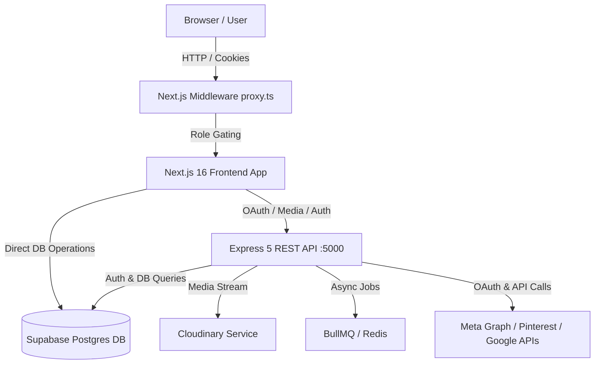

# SocialDesk — Comprehensive System Overview & Technical Architecture

## 1. 🎯 What is SocialDesk? (Project Overview)

**SocialDesk** is a multi-platform **Social Media Management & Analytics Dashboard**. It allows businesses, agency administrators, and social media managers to connect social accounts (Facebook, Instagram, Pinterest, YouTube, TikTok, LinkedIn, X), create and schedule posts, manage media assets, view real-time audience engagement analytics, and govern user permissions.

---

## 2. ✨ Key Features & Capabilities

* **OAuth & Social Account Connection**: Connect and manage OAuth credentials for platforms like Meta (Facebook Pages & Instagram Professional accounts), Pinterest, and YouTube.
* **Content Publishing & Scheduling**: Multi-platform post scheduling, supporting custom body text, hashtags, thumbnails, link attachments, and content types (post, story, reel, video, carousel).
* **Analytics & Performance Tracking**: Track account growth snapshots (followers, impressions, reach) and per-post engagement metrics (likes, comments, shares, views, saves, engagement rates).
* **Media Asset Management**: Upload and manage media assets backed by Cloudinary image/video storage and streaming.
* **Role-Based Authorization & Authentication**: Secure JWT session cookie validation with route protection. Distinguishes between **Admins** (access to user management `/management` & accounts `/accounts`) and **Standard Users**.
* **Notifications & Settings**: System event alerts (post success, post failure, weekly reports) and user notification preferences.

---

## 3. 🎨 Frontend Tech Stack & Tools

Location: [frontend/](file:///c:/Users/leoje/OneDrive/Desktop/NEW%20PROJ%20TEAM%202%20OLLOPA/frontend) (Configuration: [frontend/package.json](file:///c:/Users/leoje/OneDrive/Desktop/NEW%20PROJ%20TEAM%202%20OLLOPA/frontend/package.json))

| Layer / Concern | Tech / Tool | Usage & Purpose |
|---|---|---|
| **Framework** | **Next.js 16 (App Router)** | Full-stack React framework for server component rendering and routing. |
| **UI Library** | **React 19 & React DOM 19** | Modern component architecture. |
| **Styling** | **TailwindCSS v4 & PostCSS** | Utility-first CSS framework for design system layouts. |
| **Icons** | **Lucide React & React Icons** | UI icons for dashboard controls and social platform branding. |
| **Data Visualization** | **Recharts** | Rendering charts for analytics and performance trends. |
| **Session & Auth Helpers** | **`jose` & `js-cookie`** | Edge-compatible JWT token verification (`jose`) inside middleware and cookie handling. |
| **Database SDK** | **`@supabase/supabase-js`** | Client library querying Supabase database endpoints directly. |
| **Testing** | **Vitest** | Frontend unit tests (e.g., [proxy.test.ts](file:///c:/Users/leoje/OneDrive/Desktop/NEW%20PROJ%20TEAM%202%20OLLOPA/frontend/proxy.test.ts) for middleware verification). |

---

## 4. ⚙️ Backend Tech Stack & Tools

Location: [backend/](file:///c:/Users/leoje/OneDrive/Desktop/NEW%20PROJ%20TEAM%202%20OLLOPA/backend) (Configuration: [backend/package.json](file:///c:/Users/leoje/OneDrive/Desktop/NEW%20PROJ%20TEAM%202%20OLLOPA/backend/package.json))

| Layer / Concern | Tech / Tool | Usage & Purpose |
|---|---|---|
| **Server Engine** | **Node.js + Express 5** | REST API server running on port 5000 organizing modular feature routes. |
| **Authentication & Security** | **JWT (`jsonwebtoken`) + `bcryptjs`** | Password hashing and signed JWT token management. |
| **OAuth & HTTP Clients** | **Axios & Google APIs (`googleapis`)** | OAuth token exchanges and interfacing with Meta Graph API, Pinterest API, YouTube API. |
| **Media & File Handling** | **Multer + Cloudinary** | Processing multipart file uploads and streaming assets to Cloudinary. |
| **Async Queues & Caching** | **BullMQ + Redis (`ioredis`)** | Background task queue for post scheduling & queued processing. |
| **Validation & Schema** | **Zod & Joi** | Request payload schema validation. |
| **Document Generation** | **PDFKit** | Generating exportable analytics reports in PDF format. |
| **Development & Testing** | **Nodemon + Node Test Runner + Supertest** | Auto-reloading dev server, built-in Node test runner (`node:test`), and HTTP integration test assertion using Supertest. |

---

## 5. 🗄️ Database & Storage Infrastructure

* **Database Engine**: **Supabase (PostgreSQL)** (Schema file: [schema.sql](file:///c:/Users/leoje/OneDrive/Desktop/NEW%20PROJ%20TEAM%202%20OLLOPA/backend/database/sql/schema.sql))
* **Core Relational Tables**:
  * `users` & `user_settings`: User management and role preferences.
  * `platforms`: Platform lookup (`facebook`, `instagram`, `tiktok`, `youtube`, `pinterest`, `linkedin`, `x`).
  * `social_accounts` & `oauth_tokens`: Connected accounts and encrypted access tokens.
  * `posts` & `post_targets`: Multi-destination publishing status tracking.
  * `engagement_metrics` & `account_analytics`: Real-time post statistics and historical growth snapshots.
  * `notifications`: System user notifications log.

---

## 6. 📊 System Architecture Diagram

---

## 7. 📍 Current Development Status

Reference: [STATUS.md](file:///c:/Users/leoje/OneDrive/Desktop/NEW%20PROJ%20TEAM%202%20OLLOPA/STATUS.md)

- **Functional & Tested**: Auth, Meta OAuth (Facebook/Instagram), Pinterest OAuth, Accounts API, Analytics API, and Route protection ([proxy.ts](file:///c:/Users/leoje/OneDrive/Desktop/NEW%20PROJ%20TEAM%202%20OLLOPA/frontend/proxy.ts)).
- **In-Progress / Mock Data UI**: Dashboard, User Management, Notifications, and Profile pages.
